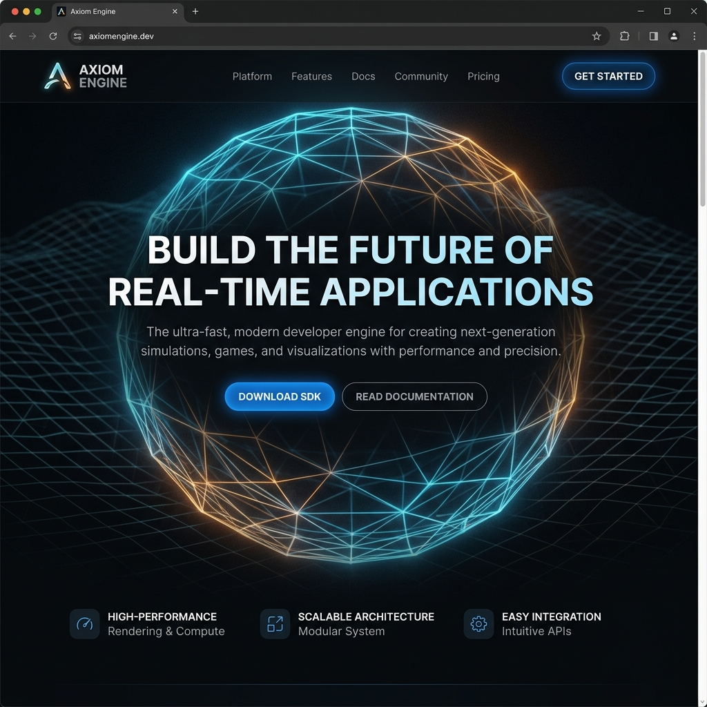

# Axiom Engine — The Edge Execution Engine

Axiom is a high-performance, decentralized edge execution engine designed for engineering teams. It allows you to run sandboxed code globally with zero cold starts, synchronizing shared state via an eventual consistency mesh.



## Features

- **Hyper-scale Edge Execution**: Execute handlers instantly close to the user in microseconds.
- **Distributed State Mesh**: Eventual consistency state management across localized nodes.
- **Collaborative Debugging**: Shared terminal outputs, logging, and memory path tracing.
- **Zero-trust Sandboxing**: Secure, resource-limited execution via WebAssembly isolates.
- **3D Telemetry Canvas**: Built-in interactive 3D visualizations in the Hero, CTA, and Footer sections using Three.js.
- **Telemetry & Live Metrics**: Direct performance logging for real-time telemetry metrics.

## Tech Stack

- **Framework**: React + TypeScript + Vite
- **Styling**: Tailwind CSS v3
- **3D Graphics**: Three.js + React Three Fiber + React Three Drei
- **Icons**: Lucide React
- **Animations**: CSS Keyframes & scroll-reveal hook (`IntersectionObserver`)

## Getting Started

### Prerequisites

Ensure you have Node.js installed (v18+ recommended).

### Installation

1. Clone the repository:
   ```bash
   git clone https://github.com/ArnavNah/Axiom-Engine-v0.git
   cd Axiom-Engine-v0
   ```

2. Install dependencies:
   ```bash
   npm install
   ```

3. Start the local development server:
   ```bash
   npm run dev
   ```

The site will be running at `http://localhost:5173/`.

### Build for Production

To build the static assets for production:
```bash
npm run build
```
The optimized bundle will be created in the `dist` directory.

## License

MIT © 2026 Axiom Engine.
